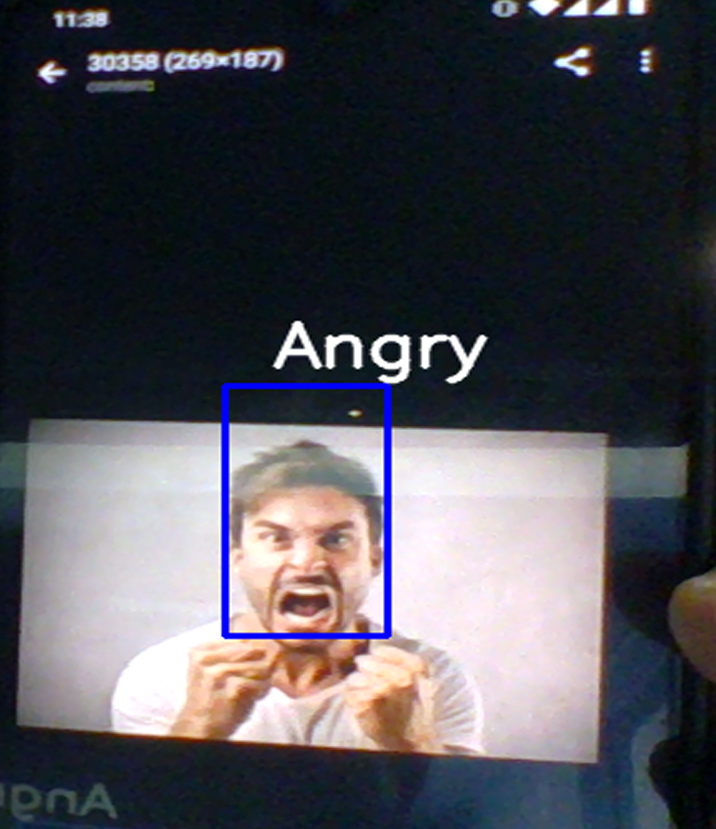
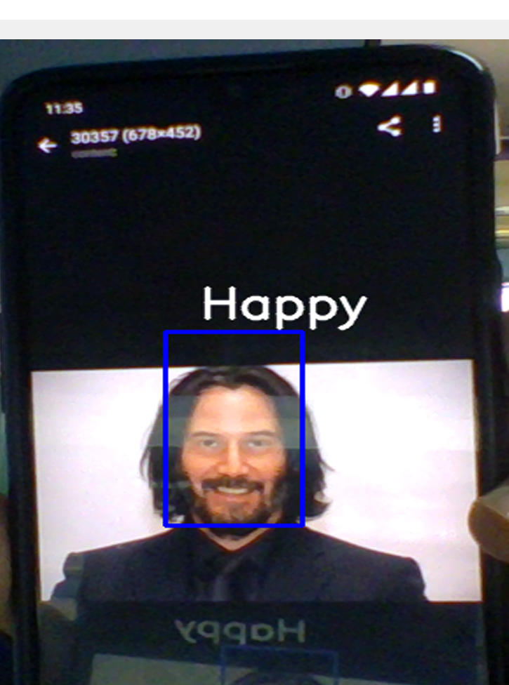

# Emotion_Detection_FER2013
Facial Expression Recognition on FER2013 Dataset using Convolutional Neural Networks.

In this project, we try to accurately classify facial expressions into one of seven categories given below.

Angry----Disgust----Fear----Happy----Sad----Surprise----Neutral

## Dataset

The dataset for this project can be found at this link:- https://www.kaggle.com/deadskull7/fer2013  
Download and upzip the file.  
This is a single csv file and contains information about ~ 32300 images.  

## Model

The model achieved a maximum accuracy of ~ 63%.  
You can find the model along with the pre-processing steps in the file `Emotion_Recognition_Train.ipynb`

## Usage

`python Detector_In_Action.py`

This will start the webcam and feed the frames obtained through our trained model for inference.  
Haarcascade is used to detect the faces in the frames and the detected region is cropped to the  
desired size and fed to the detector as input.

## Sample Output
  

If you have any issues or doubts, feel free to ask. I'll do my best to answer them. :)

Keep chasing your dreams ! ⭐️
